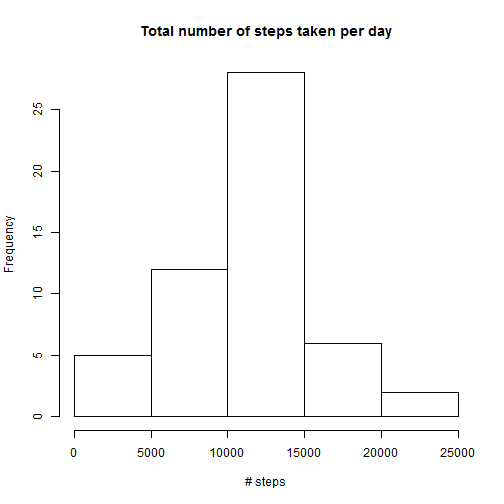
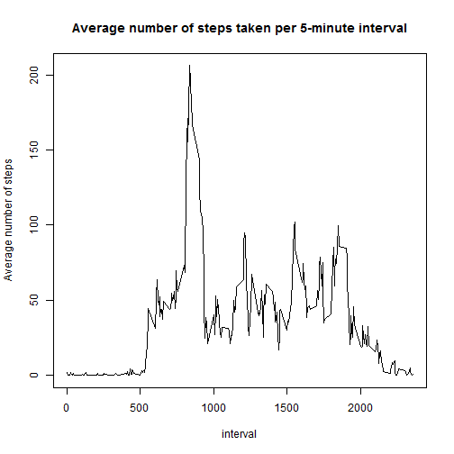
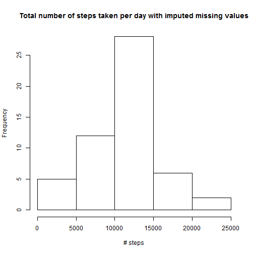
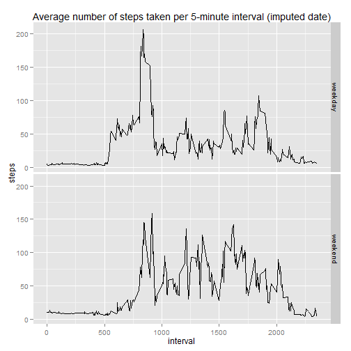

## Loading and preprocessing the data

```r
unzip("./activity.zip")
activity <- read.csv("./activity.csv")

library(lubridate)
activity$date <- ymd(activity$date)
```


## What is mean total number of steps taken per day?

```r
stepsperday <- aggregate(steps ~ date, activity, sum)
hist(stepsperday$steps, main = "Total number of steps taken per day", xlab = "# steps")
```

 

```r
steps.mean <- mean(stepsperday$steps)
steps.median <- median(stepsperday$steps)
```

With regards to the total number of steps taken per day, the mean is 1.0766 &times; 10<sup>4</sup> and the median is 10765


## What is the average daily activity pattern?

```r
stepsperinterval <- aggregate(steps ~ interval, activity, mean)
plot(x = stepsperinterval$interval,
     y = stepsperinterval$steps,
     type="l",
     main = "Average number of steps taken per 5-minute interval",
     xlab = "interval",
     ylab = "Average number of steps")
```

 

```r
steps.max <- stepsperinterval$interval[which.max(stepsperinterval$steps)]
```


As can be seen from the plot above, interval 835 is the 5-minute interval that, on average across all the days in the dataset, contains the maximum number of steps.


## Imputing missing values

```r
missing.values <- sum(is.na(activity$steps))

# impute the missing values with the mean activity for that 5-minute interval
activity.imputed <- activity
missing.values.rows <- which(is.na(activity.imputed))
activity.imputed$steps[missing.values.rows] <- merge(x = activity.imputed[missing.values.rows, ],
                                                     y = stepsperinterval,
                                                     by = c("interval"),
                                                     all.x = TRUE)$steps.y

stepsperday.imputed <- aggregate(steps ~ date, activity.imputed, sum)
hist(stepsperday$steps, main = "Total number of steps taken per day with imputed missing values", xlab = "# steps")
```

 

```r
steps.imputed.mean <- mean(stepsperday.imputed$steps)
steps.imputed.median <- median(stepsperday.imputed$steps)
```

There are 2304 missing values in the dataset.

With regards to the total number of steps taken per day, the mean is 1.0766 &times; 10<sup>4</sup> and the median is 1.1015 &times; 10<sup>4</sup>

In comparison with the original values, imputing changed the mean by 0 and the median by 250


## Are there differences in activity patterns between weekdays and weekends?

```r
Sys.setlocale("LC_TIME", "English") #in order to have the english day names
```

```
## [1] "English_United States.1252"
```

```r
activity.imputed$weekday <- weekdays(activity.imputed$date)

activity.weekend <- activity.imputed$weekday == "Saturday" | activity.imputed$weekday == "Sunday"
activity.imputed$day <- "weekday"
activity.imputed$day[activity.weekend] <- "weekend"
activity.imputed$day <- factor(activity.imputed$day)

library(ggplot2)
stepsperinterval.imputed <- aggregate(steps ~ interval + day, activity.imputed, mean)
ggplot(stepsperinterval.imputed, aes(x=interval, y=steps)) +
  geom_line() +
  facet_grid(day ~ .) +
  labs(title = "Average number of steps taken per 5-minute interval (imputed date)")
```

 
